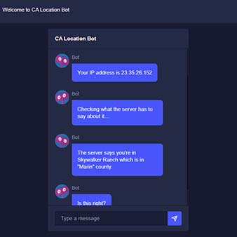
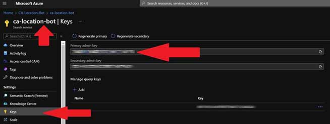
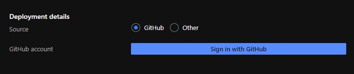
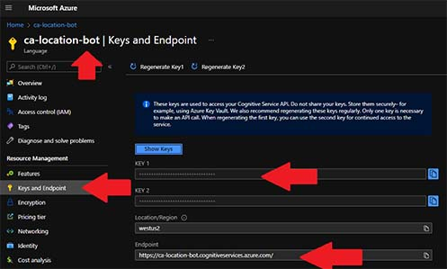

# CA Location Chatbot
This bot was created as a proof of concept to locate a public unonmous user in California using a live chat bot before transferring the conversation to a live agent.


___
## Demo and Usage
You can try out the bot yourself at [https://techlifornia.us](https://techlifornia.us).

It will:
1. Greet you
2. Make a call to ipify.org to get your ip address
3. Make a call to the back-end application to figure out where your ip address is located
    - If it is in California it will tell you where it found you to be (city and county) and ask if it is correct
    - If it is not identified or not in California it will ask where you are in California (either city or county)
        - Once you type in a city or county in California it will make a call to back-end application to search for the closest entry that exists in the list of cities and counties on the [California Department of Tax](https://www.cdtfa.ca.gov/taxes-and-fees/rates.aspx) website as of October 2021
        - If it finds a match it will tell you where it found you to be (City and County) and ask if it is correct
        - If it does not find a match it will ask you ask again where you are in California (either city or county)
4. Once you confirm the county the bot found you to be type "yes" (without the quotes) and the bot will transfer the conversation to a surprise live agent
5. The live agent is in fact a QnA Maker knowledgebase that is trained to answer specific questions about the surprise live agent
___
## Free Third-Party Technology Used
- The ip address is obtained from [ipify.org](https://ipify.org).
- The ip address location is looked up from the [MaxMind GeoLite2](https://www.maxmind.com/en/geoip2-services-and-databases) database.
- The database is downloaded as a gzip tarball so [SharpZipLib](http://icsharpcode.github.io/SharpZipLib/) was used to decompress it.
- The manual entry of city/county is looked up in [Azure Cognitive Search](https://azure.microsoft.com/en-us/services/search/).
- The live agent "Question Answering" (<em>previously QnA Maker</em>) is done using [Azure Cognitive Services for Language](https://azure.microsoft.com/en-us/services/cognitive-services/question-answering/).
- The bot theme was taken from [Nebular](https://akveo.github.io/nebular/) dark theme.
- The front-end client was written in [Angular](https://angular.io/) and [Typescript](https://www.typescriptlang.org/) in [Visual Studio Code IDE](https://code.visualstudio.com/).
- The back-end application was written in [C# 10](https://docs.microsoft.com/en-us/dotnet/csharp/) using [Dotnet 6 SDK](https://dotnet.microsoft.com/en-us/download/dotnet/6.0) in [Visual Studio 2022 IDE](https://visualstudio.microsoft.com/vs/).
- Hosting happens with [Azure Static Web App](https://azure.microsoft.com/en-us/services/app-service/static/) where the api is on [Azure Functions](https://azure.microsoft.com/en-us/services/functions/).
.
___
## Cloud Services Needed
You will need the following free cloud services established:
### MaxMind
1. [Sign Up](https://www.maxmind.com/en/geolite2/signup?lang=en) for GeoLite2 Free Geolocation Data
2. [Generate](https://www.maxmind.com/en/accounts/current/license-key?lang=en) a License Key
3. Write down your Account/User ID and the License Key
    - You won't have another opportunity to see that key so keep it in a safe place
### GitHub
1. If you don't already have a GitHub account, [Sign Up](https://github.com/signup) for one
2. There are a few otions to proceed:
    - Click on the "[Use this template](https://github.com/glensouza/ca-location-bot/generate)" button to generate a new repository onto your own GitHub account
    - Clone [this](https://github.com/glensouza/ca-location-bot) repository on your development workstation and if you feel like contributing to it you can create a Pull Request
    - Fork [this](https://github.com/glensouza/ca-location-bot) repository to your own GitHub account by clicking on the "Fork" button on top right of the page to continue this work with your own requirements
    - Create your own repository:
        - Create new [repository](https://github.com/new) on your GitHub account
        - Clone the new repository locally on your development workstation
        - Clone [this](https://github.com/glensouza/ca-location-bot) reporitory locally on your development workstation in a different directory
        - Copy the contents that you like from this of this repository onto your own repository's directory
        - Push your changes to the new repository
3. If you created your own repository and intend on deploying it to your own hosting environment make sure to delete the file [https://github.com/glensouza/ca-location-bot/tree/main/.github/workflows/azure-static-web-apps-wonderful-meadow-06f3bbc1e.yml](https://github.com/glensouza/ca-location-bot/tree/main/.github/workflows) as that is specific to my own Azure resource in step 5 of the **Azure** section, but before you do take a look at it and compare it to what yours look like - it might help you troubleshoot if something goes wrong.
### Azure
1. If you don't already have an Azure account, [Sign Up](https://azure.microsoft.com/en-us/free/) for a free account today
    - Includes the services we need to run the bot for free (with limits of course)
    - You will get $200 credit to try out other services that are not free for the first 30 days from your account creation
2. Create a [Resource Group](https://portal.azure.com/#create/Microsoft.ResourceGroup)
3. Create an [Application Insights](https://portal.azure.com/#create/Microsoft.AppInsights)
4. Create a [Search Service](https://portal.azure.com/#create/Microsoft.Search)
    - Save the name of the Search Service and the primary search key for later use in code

        

5. Create a [Static Web App](https://portal.azure.com/#create/Microsoft.StaticApp)
    - The most important part during creation selecting your GitHub repository

        
6. Create a "**Language Service**"
    - Ensure you click on "**Custom question answering**" option
7. Head over to the newly created Language Service
    - Save the name of the Language Service, the key 1 and the Endpoint for later use in code

        
8. Head on over to the [Cognitive Services Language Studio](https://language.cognitive.azure.com/home)
    - Scroll down to the "Answer Questions" section
    - Click on "*Custom question answering*"
    - Create new project and make sure you select the *search service* you created on step 4
    - Under "*Manage Sources*" let's start with adding a "*ChitChat*" and select one you like, I picked "*Witty*"
___
## Development Workstation
### Required Installed Free Software
- front-end client was written in [Angular](https://angular.io/) and [Visual Studio Code IDE](https://code.visualstudio.com/).
    - You will need to have [NodeJS](https://nodejs.org/en/) installed
        - By default it installs the [npm client](https://docs.npmjs.com/about-npm)
    - You will need to have [Angular CLI](https://angular.io/guide/setup-local) installed by typing into your terminal:
        ```bash
        npm install -g @angular/cli
        ```
- The back-end application was written in [C# 10](https://docs.microsoft.com/en-us/dotnet/csharp/) using [Dotnet 6 SDK](https://dotnet.microsoft.com/en-us/download/dotnet/6.0) and [Visual Studio 2022 IDE](https://visualstudio.microsoft.com/vs/).
    - If you install Visual Studio 2022 you should already get C# and Dotnet installed
    - You will need to have [Static Web Apps CLI](https://github.com/Azure/static-web-apps-cli) installed by typing into your terminal:
        ```bash
        npm install -g @azure/static-web-apps-cli
        ```
### Running it locally on your development workstation
#### Back-end api
- Rename the local.settings.example.json file to local.settings.json
- Open up the CALocationBot.sln file in Visual Studio
- In Visual Studio, open the local.settings.json file and add your keys and secrets from when you established the cloud services:
    ```json
    {
        "GeoLiteAccountUserId": "000000",
        "GeoLiteLicenseKey": "xxxxxxxxxxxxxxxx",
        "SearchServiceName": "<your-search-service-name>",
        "SearchIndexName": "city-county",
        "SearchApiKey": "XXXXXXXXXXXXXXXXXXXXXXXXXXXXXXXX",
        "QnAKnowledgebaseId": "<your-language-service-name>",
        "QnAEndpointKey": "xxxxxxxxxxxxxxxxxxxxxxxxxxxxxxxx",
        "QnAEndpointHostName": "https://<your-hostname>.cognitiveservices.azure.com/"
    }
    ```
- Run the project. By default, it will be available in port 7071.
#### Front-end client

- Open up two terminals and on both terminals navigate to the directory where you have cloned the repository.
    - Leave one terminal on the root of the repository.
    - In the other terminal navigate to the "*client*" directory.

github

settings files

- [Visual Studio Code IDE](https://code.visualstudio.com/):
- [Dotnet 6 SDK](https://dotnet.microsoft.com/en-us/download/dotnet/6.0)
- [Visual Studio 2022 IDE](https://visualstudio.microsoft.com/vs/).

This project was generated with [Angular CLI](https://github.com/angular/angular-cli) version 13.0.4.

Run `ng serve` for a dev server. Navigate to `http://localhost:4200/`. The app will automatically reload if you change any of the source files.

## Code scaffolding

Run `ng generate component component-name` to generate a new component. You can also use `ng generate directive|pipe|service|class|guard|interface|enum|module`.

## Build

Run `ng build` to build the project. The build artifacts will be stored in the `dist/` directory.

## Running unit tests

Run `ng test` to execute the unit tests via [Karma](https://karma-runner.github.io).

## Running end-to-end tests

Run `ng e2e` to execute the end-to-end tests via a platform of your choice. To use this command, you need to first add a package that implements end-to-end testing capabilities.

## Further help

To get more help on the Angular CLI use `ng help` or go check out the [Angular CLI Overview and Command Reference](https://angular.io/cli) page.

___
# Blazor Starter Application

This template contains an example .NET 6 [Blazor WebAssembly](https://docs.microsoft.com/aspnet/core/blazor/?view=aspnetcore-6.0#blazor-webassembly) client application, a .NET 6 C# [Azure Functions](https://docs.microsoft.com/azure/azure-functions/functions-overview), and a C# class library with shared code.

## Getting Started

1. Create a repository from the [GitHub template](https://docs.github.com/en/enterprise/2.22/user/github/creating-cloning-and-archiving-repositories/creating-a-repository-from-a-template) and then clone it locally to your machine.

1. In the **Api** folder, copy `local.settings.example.json` to `local.settings.json`

1. Continue using either Visual Studio or Visual Studio Code.

### Visual Studio 2022

Once you clone the project, open the solution in [Visual Studio 2022](https://visualstudio.microsoft.com/vs/) and follow these steps:

1. Right-click on the solution and select **Set Startup Projects...**.

1. Select **Multiple startup projects** and set the following actions for each project:
    - *Api* - **Start**
    - *ApiIsolated* - None
    - *Client* - **Start**
    - *Shared* - None

1. Press **F5** to launch both the client application and the Functions API app.

### Visual Studio Code with Azure Static Web Apps CLI

1. Install the [Azure Static Web Apps CLI](https://www.npmjs.com/package/@azure/static-web-apps-cli) and [Azure Functions Core Tools CLI](https://www.npmjs.com/package/azure-functions-core-tools).

1. Open the folder in Visual Studio Code.

1. In the VS Code terminal, run the following command to start the Static Web Apps CLI, along with the Blazor WebAssembly client application and the Functions API app:

    ```bash
    swa start http://localhost:5000 --run "dotnet run --project Client/Client.csproj" --api-location Api
    ```

    The Static Web Apps CLI (`swa`) first starts the Blazor WebAssembly client application and connects to it at port 5000, and then starts the Functions API app.

1. Open a browser and navigate to the Static Web Apps CLI's address at `http://localhost:4280`. You'll be able to access both the client application and the Functions API app in this single address. When you navigate to the "Fetch Data" page, you'll see the data returned by the Functions API app.

1. Enter Ctrl-C to stop the Static Web Apps CLI.

## Template Structure

- **Client**: The Blazor WebAssembly sample application
- **Api**: A C# Azure Functions API, which the Blazor application will call
- **Shared**: A C# class library with a shared data model between the Blazor and Functions application
- **ApiIsolated**: A C# Azure Functions API using the .NET isolated execution model, which the Blazor application will call. This version can be used instead of the in-process function app in `Api`.

## Deploy to Azure Static Web Apps

This application can be deployed to [Azure Static Web Apps](https://docs.microsoft.com/azure/static-web-apps), to learn how, check out [our quickstart guide](https://aka.ms/blazor-swa/quickstart).
